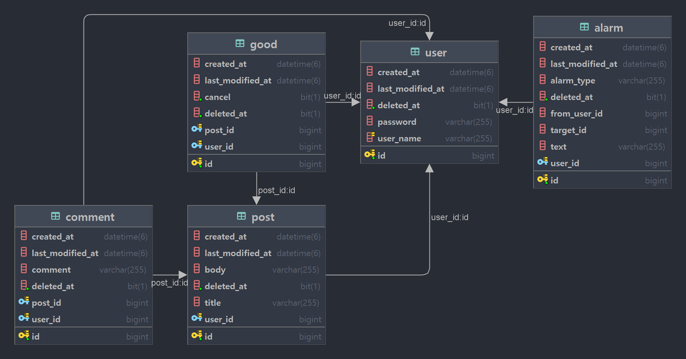

# 🦁 MutsaSNS 🦁

👉🏻 http://ec2-3-35-27-1.ap-northeast-2.compute.amazonaws.com:8080/swagger-ui/

## 개발환경

---

- 에디터 : Intellij Ultimate
- 개발 툴 : SpringBoot 2.7.5
- 자바 : JAVA 11
- 빌드 : Gradle 6.8
- 서버 : AWS EC2
- 배포 : Docker
- 데이터베이스 : MySql 8.0
- 라이브러리 : SpringBoot Web, MySQL, Spring Data JPA, Lombok, Spring Security

## 📎 서비스 소개

---

### 1️⃣ 회원 인증·인가

- 모든 회원은 회원가입을 통해 회원이 됩니다.
- 로그인을 하지 않으면 SNS 기능 중 피드를 보는 기능만 가능합니다.
- 로그인한 회원은 글쓰기, 수정, 댓글, 좋아요, 알림 기능이 가능합니다.

### 2️⃣ 글쓰기

- 포스트를 쓰려면 회원가입 후 로그인을 해야 합니다.
- 포스트의 한 페이지는 20개씩 보이고 총 몇 개의 페이지인지 표시가 됩니다.
- 로그인 하지 않아도 글 목록을 조회 할 수 있습니다.
- 수정 기능은 글을 쓴 회원만이 권한을 가집니다.
- 포스트의 삭제 기능은 글을 쓴 회원만이 권한을 가집니다.

### 3️⃣ 피드

- 로그인 한 회원은 자신이 작성한 글 목록을 볼 수 있습니다.

### 4️⃣ 댓글

- 댓글은 회원만이 권한을 가집니다.
- 회원은 다수의 댓글을 달 수 있습니다.

### 5️⃣ 좋아요

- 좋아요는 회원만 권한을 가집니다.
- 좋아요 기능은 취소가 가능합니다.

### 6️⃣ 알림

- 알림은 회원이 자신이 쓴 글에 대해 다른회원의 댓글을 올리거나 좋아요시 받는 기능입니다.
- 알림 목록에서 자신이 쓴 글에 달린 댓글과 좋아요를 확인할 수 있습니다.

## 📎 ERD

[//]: # (![img.png]&#40;img.png&#41;)

## 📎 Endpoint

|  auth   | Method |                      URL                      | Request Body                                                      | Success Response                                                                                                                                                                                                                                                                                                                                                                                                                                                                                                                                                                                                                                              | Error Response                                                                                                                                                                                                                                                   |
|:-------:|:------:|:---------------------------------------------:|-------------------------------------------------------------------|---------------------------------------------------------------------------------------------------------------------------------------------------------------------------------------------------------------------------------------------------------------------------------------------------------------------------------------------------------------------------------------------------------------------------------------------------------------------------------------------------------------------------------------------------------------------------------------------------------------------------------------------------------------|------------------------------------------------------------------------------------------------------------------------------------------------------------------------------------------------------------------------------------------------------------------|
|  회원가입   |  POST  |              /api/v1/users/join               | { 　"userName": "user", 　"password": "password" }         | { 　"resultCode": "SUCCESS", 　"result":{ 　　"userName": "user", 　　"password": "$2a$10$qX4yDGJOR1CccN7OqMXyYejtTx7uuggh0CVS4BouOl6oMtViwZlZ." 　} }                                                                                                                                                                                                                                                                                                                                                                                                                                                                                             | {  "resultCode": "ERROR",  "result":{ 　 "errorCode": "DUPLICATED_USER_NAME", 　 "message": "UserName이 중복됩니다." 　} }                                                                                                                              |
|   로그인   |  POST  |              /api/v1/users/login              | { 　"userName": "user", 　"password": "password" }         | { "　resultCode": "SUCCESS", 　"result":{ 　　"jwt": "token" 　} }                                                                                                                                                                                                                                                                                                                                                                                                                                                                                                                                                                                  | { 　"resultCode": "ERROR", 　"result":{ 　　"errorCode": "USERNAME_NOT_FOUND", 　　"message": "유저가 존재하지 않습니다." 　} }
{ 　"resultCode": "ERROR", 　"result":{ 　　"errorCode": "INVALID_PASSWORD", 　　"message": "패스워드가 잘못되었습니다." 　} } |
| 포스트 리스트 |  GET   |                                               |                                                                   | { 　"resultCode": "SUCCESS", 　"result":{ 　　"content":[ 　　　{ 　　　　"id": 1, 　　　　"title": "title", 　　　　"body": "body", 　　　　"userName": "user", 　　　　"createdAt": "2023-01-09T10:24:21.597156", 　　　　"lastModifiedAt": "2023-01-09T10:24:21.597156" 　　　} 　　], 　　"pageable": "INSTANCE", 　　"last": false, 　　"totalElements": 9, 　　"totalPages": 1, 　　"size": 20, 　　"number": 0, 　　"sort":{ 　　　"empty": true, 　　　"sorted": false, 　　　"unsorted": true 　　}, 　　"first": true, 　　"numberOfElements": 1, 　　"empty": false 　} }                                                          |                                                                                                                                                                                                                                                                  |
| 포스트 상세  |  GET   |            /api/v1/posts/{postsId}            |                                                                   | { 　"resultCode": "SUCCESS", 　"result":{ 　　"id": 1, 　　"title": "title", 　　"body": "body", 　　"userName": "user", 　　"createdAt": "2023-01-09T10:24:21.597156", 　　"lastModifiedAt": "2023-01-09T10:24:21.597156" 　} }                                                                                                                                                                                                                                                                                                                                                                                                               |                                                                                                                                                                                                                                                                  |
| 포스트 등록  |  POST  |                 /api/v1/posts                 | { 　"title": "title", 　"body": "body" }                   | { 　"resultCode": "SUCCESS", 　"result":{ 　　"message": "포스트 등록 완료", 　　"postId": 1 　} }                                                                                                                                                                                                                                                                                                                                                                                                                                                                                                                                                        |                                                                                                                                                                                                                                                                  |
| 포스트 수정  |  PUT   |            /api/v1/posts/{postsId}            | { 　"title": "modified title", 　"body": "modified body" } | { 　"resultCode": "SUCCESS", 　"result":{ 　　"message": "포스트 수정 완료", 　　"postId": 1 　} }                                                                                                                                                                                                                                                                                                                                                                                                                                                                                                                                                        | { 　"resultCode": "ERROR", 　"result":{ 　　"errorCode": "INVALID_PERMISSION", 　　"message": "사용자가 권한이 없습니다." 　} }                                                                                                                                  |
| 포스트 삭제  | DELETE |            /api/v1/posts/{postsId}            |                                                                   | { 　"resultCode": "SUCCESS", 　"result":{ 　　"message": "포스트 삭제 완료", 　　"postId": 1 　} }                                                                                                                                                                                                                                                                                                                                                                                                                                                                                                                                                        | { 　"resultCode": "ERROR", 　"result":{ 　　"errorCode": "INVALID_PERMISSION", 　　"message": "사용자가 권한이 없습니다." 　} }
{ 　"resultCode": "ERROR", 　"result":{ 　　"errorCode": "POST_NOT_FOUND", 　　"message": "해당 포스트가 없습니다." 　} }    |
|  마이 피드  |  GET   |               /api/v1/posts/my                |                                                                   | { 　"resultCode": "SUCCESS", 　"result":{ 　　"content":[ 　　　{ 　　　"id": 1, 　　　"title": "title", 　　　"body": "body", 　　　"userName": "user", 　　　"createdAt": "2023-01-09T10:24:21.597156", 　　　"lastModifiedAt": "2023-01-09T10:24:21.597156" 　　　} 　　], 　　"pageable":{"sort":{"empty": true, "sorted": false, "unsorted": true }, "offset": 0,…}, 　　"last": true, 　　"totalPages": 1, 　　"totalElements": 1, 　　"size": 20, 　　"number": 0, 　　"sort":{ 　　　"empty": true, 　　　"sorted": false, 　　　"unsorted": true 　　}, 　　"first": true, 　　"numberOfElements": 1, 　　"empty": false 　} } |                                                                                                                                                                                                                                                                  |
| 댓글 리스트  |  GET   |       /api/v1/posts/{postsId}/comments        |                                                                   |                                                                                                                                                                                                                                                                                                                                                                                                                                                                                                                                                                                                                                                               |                                                                                                                                                                                                                                                                  |
|  댓글 작성  |  POST  |       /api/v1/posts/{postsId}/comments        | { 　  "comment": "comment" }                                 | { 　"resultCode": "SUCCESS", 　"result":{ 　　"createdAt": "2023-01-09T10:24:21.597156", 　　"lastModifiedAt": "2023-01-09T10:24:21.597156", 　　"id": 10, 　　"comment": "댓글", 　　"userName": "user", 　　"postId": 1 　} }                                                                                                                                                                                                                                                                                                                                                                                                                  |                                                                                                                                                                                                                                                                  |
|  댓글 수정  |  PUT   | /api/v1/posts/{postsId}/comments/{commentsId} | { 　  "comment": "modified comment" }                        | { 　"resultCode": "SUCCESS", 　"result":{ 　　"createdAt": "2023-01-09T10:24:21.597156", 　　"lastModifiedAt": "2023-01-09T10:24:21.597156", 　　"id": 2, 　　"comment": "modified comment", 　　"userName": "user", 　　"postId": 1 　} }                                                                                                                                                                                                                                                                                                                                                                                                     | { 　"resultCode": "ERROR", 　"result":{ 　　"errorCode": "POST_NOT_FOUND", 　　"message": "해당 포스트가 없습니다." 　} }                                                                                                                                       |
|  댓글 삭제  | DELETE | /api/v1/posts/{postsId}/comments/{commentsId} |                                                                   | { 　"resultCode": "SUCCESS", 　"result":{ 　　"message": "댓글 삭제 완료", 　　"id": 11 　} }                                                                                                                                                                                                                                                                                                                                                                                                                                                                                                                                                            | { 　"resultCode": "ERROR", 　"result":{ 　　"errorCode": "INVALID_PERMISSION", 　　"message": "사용자가 권한이 없습니다." 　} }
{ 　"resultCode": "ERROR", 　"result":{ 　　"errorCode": "POST_NOT_FOUND", 　　"message": "해당 포스트가 없습니다." 　} }    |
| 좋아요 개수  |  GET   |         /api/v1/posts/{postsId}/likes         |                                                                   | { 　"resultCode": "SUCCESS", 　"result": 1 }                                                                                                                                                                                                                                                                                                                                                                                                                                                                                                                                                                                                           |                                                                                                                                                                                                                                                                  |
| 좋아요 누르기 |  POST  |         /api/v1/posts/{postsId}/likes         |                                                                   | { 　"resultCode":"SUCCESS", 　"result": "좋아요를 눌렀습니다."}                                                                                                                                                                                                                                                                                                                                                                                                                                                                                                                                                                                                    | { 　"resultCode": "ERROR", 　"result":{ 　　"errorCode": "POST_NOT_FOUND", 　　"message": "해당 포스트가 없습니다." 　} }                                                                                                                                       |
| 알람 리스트  |  GET   |                /api/v1/alarms                 |                                                                   | { 　"resultCode": "SUCCESS", 　"result":{ 　　"content":[ 　　　{ 　　　　"id": 1, 　　　　"alarmType": "NEW_LIKE_ON_POST", 　　　　"fromUserId": 2, 　　　　"targetId": 1, 　　　　"text": "new like!", 　　　　"createdAt": "2023-01-9T15:24:43.342071" 　　　} 　　] 　} }                                                                                                                                                                                                                                                                                                                                                                            |                                                                                                                                                                                                                                                                  |
